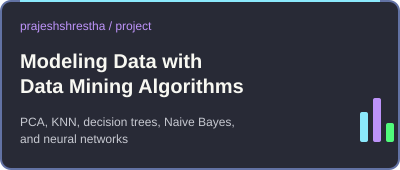
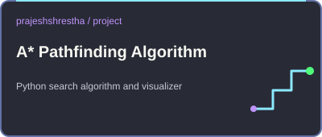

  
  
  <h1>
    Hi there, I'm Prajesh Shrestha!
  </h1>
  
  <h3>AI Engineer | NLP & Deep Learning Specialist</h3>

  

    I'm an AI Engineer with a passion for building intelligent systems. My primary focus is on Natural Language Processing (NLP), Large Language Models (LLMs), and exploring the depths of Deep Learning. I'm currently fascinated by the implementation of advanced RAG pipelines.
  

  
  

    
    
    
  

---

### What I'm Up To

- **I’m currently building:** An Agentic AI framework
- **I’m currently learning:** Advanced techniques in **LLM fine-tuning and alignment**.
- All of my public projects are available on my **[GitHub Repositories](https://github.com/prajeshshrestha?tab=repositories)**.
- **Fun fact:** The concept of a "neuron" in a neural network is inspired by biological neurons, but it's a vast simplification. A single biological neuron is as complex as an entire small neural network!

---

### My Tech Stack

  
| AI / ML | Backend & Databases | Languages | Tools & Platforms |
|---|---|---|---|
| 
      
 | 
      
 | 
     
 | 
     
 |

---

### GitHub Stats & Activity

<picture>
  <source media="(prefers-color-scheme: dark)" srcset="./assets/stats/overview.dark.svg" />
  
</picture>

<picture>
  <source media="(prefers-color-scheme: dark)" srcset="./assets/stats/rhythm.dark.svg" />
  
</picture>

<picture>
  <source media="(prefers-color-scheme: dark)" srcset="./assets/stats/contributions.dark.svg" />
  
</picture>

More activity: contribution types and languages

<picture>
  <source media="(prefers-color-scheme: dark)" srcset="./assets/stats/composition.dark.svg" />
  
</picture>

<picture>
  <source media="(prefers-color-scheme: dark)" srcset="./assets/stats/languages.dark.svg" />
  
</picture>

---

### Pinned Projects

  

    
    
  

  

